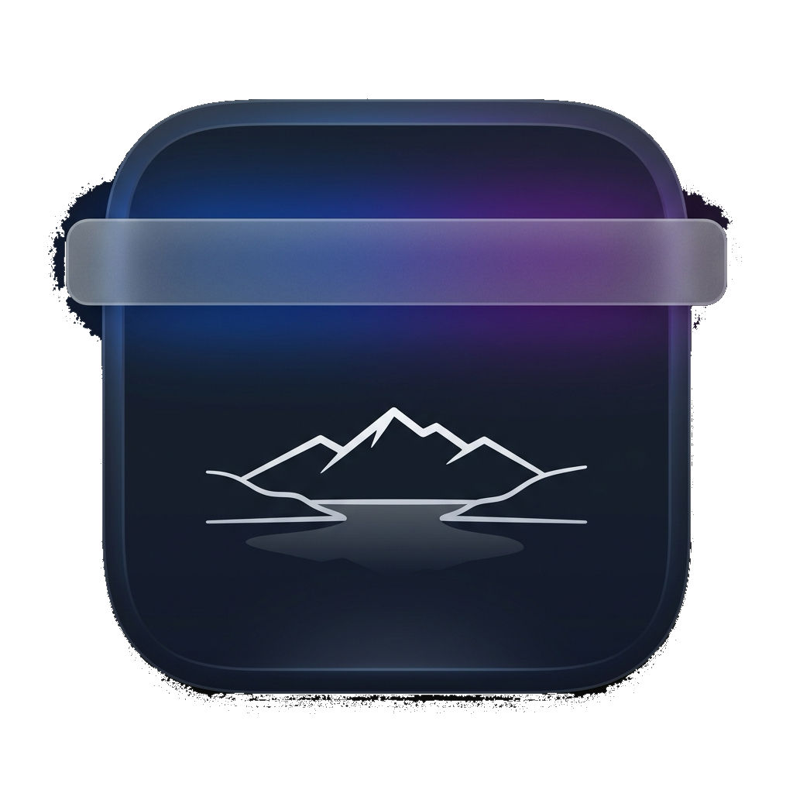

# TahoeMenuBar

> Tahoe to Sequoia - Transparent Menu Bar for macOS.

Make the macOS menu bar fully transparent with zero background CPU usage and zero external dependencies.

<p align="center"></p>

## Highlights

- **Pure native Cocoa & Swift**: lightweight compiled binary (~150 KB).
- **Zero background CPU usage (0.0%)**: no background polling, no timers, no file system watchers, zero battery impact.
- **Zero external dependencies**: built exclusively with native macOS frameworks (`AppKit`, `QuartzCore`, `ServiceManagement`).
- **Clean wallpaper slice rendering**: accurate CoreGraphics desktop slice sampling with native Light and Dark mode adaptation.
- **Minimal menu**:
  - **Refresh** (`⌘R`): manually updates the wallpaper crop slice when you change your desktop wallpaper.
  - **Launch at Login**: toggle auto-start with macOS using Apple's `SMAppService`.
  - **Quit** (`⌘Q`).

## How it Works

1. On launch, the app retrieves the current desktop wallpaper image (`NSWorkspace.shared.desktopImageURL`).
2. It calculates the exact top slice corresponding to the system menu bar height, taking into account display aspect ratio and Retina backing scale factor.
3. The slice is rendered using native `CABackdropLayer` with CoreAnimation filters for Light/Dark mode.
4. macOS renders all system menu items, status icons, and control center elements seamlessly on top.
5. After launch, the app remains completely idle with zero background activity until you refresh or switch appearance.

## Building

To build `TahoeMenuBar.app`:

```bash
./build.sh
```

The compiled application will be generated in `build/TahoeMenuBar.app`. You can run it directly or copy it into `/Applications`.

## Requirements

- macOS 14 Sonoma, macOS 15 Sequoia, macOS 26 Tahoe or later.
- Static wallpaper set to "Fill Screen".

## License

[GNU General Public License v3.0](LICENSE)